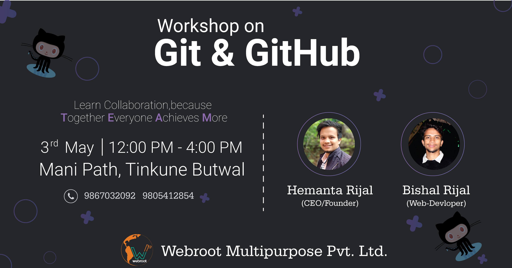

# Intro to Git Workshop

#### Contact Info
Instructor: 
* Bishal Rijal  
Email:  bishalrijal110@gmail.com 
* Hemanta Rijal  
Email:  foreverhemanta221@gmail.com

### objective 

* Introduction to Git & GitHub
      - basics of git
      - GitHub Browser
    
* Individual repositories
    - learn to create a repo on Github and update via Git
    - clone a repository ( copy from GitHub browser to local machine using git )
    - add/change the files 
    - push files to remote 
    - create a branch and work from it 
    - merge branch to master 
    - add collaborators     
    - undo Git changes 

* Collaborating 
  - clone an organizatin's repo
  - make changes and submit a pull request
