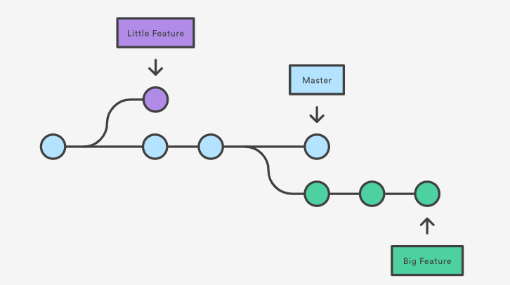
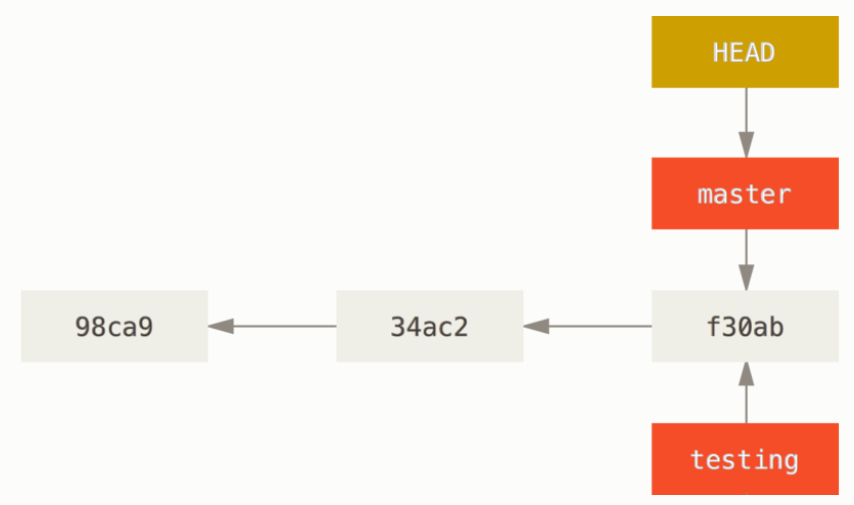
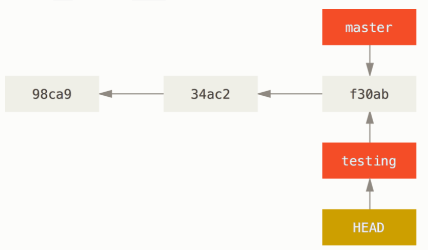
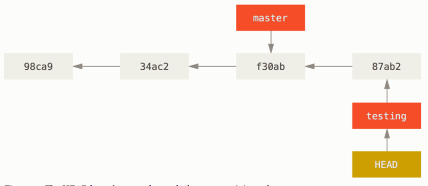
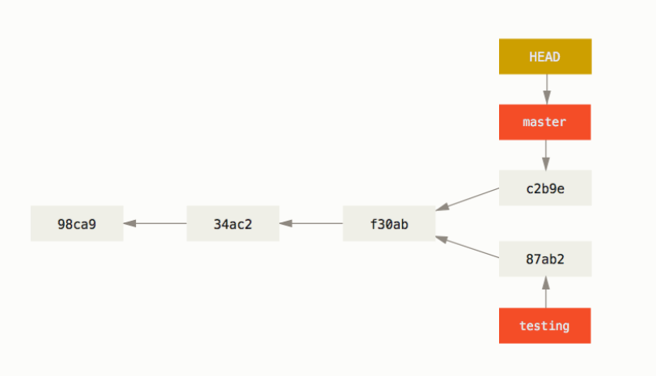

# Branches
* A branches represent an independent line of development.
## why we use braches?
* branches diverge from your main line of development and continue to do work without changing the main line
* think of them as a way to request a brand new working directory, staging area, and project history
 * in Git, branches are a part of your everyday development process. 
    * when you want to add a new feature or fix a bug—no matter how big or how small,  spawn a new branch to encapsulate your changes
    * this makes sure that unstable code is never committed to the main code base
    * it gives you the chance to clean up your feature’s history before merging it into the main branch


|:--:| 
*Figure.Branches and its commit history*

## creating a New Branch
let's say we want to craete a new branch called testing
```bash
git branch testing
```

## switching to new branch
let's switch to the new branch called testing
```bash
 git checkout testing
Switched to branch 'testing'
```

### Commit into new branch
create a new file called test.txt and write your first name into it 
let's check the status 
```bash
 git status
On branch testing
Untracked files:
  (use "git add <file>..." to include in what will be committed)

        test.txt

nothing added to commit but untracked files present (use "git add" to track)


```
let's commit it 
```bash
git commit -am 'made a change'
[testing fc90d66] made a change
 1 file changed, 1 insertion(+)
 create mode 100644 test.txt
```

## switching back to the master
```bash
 git checkout master
Switched to branch 'master'
Your branch is up to date with 'origin/master'.
```
### let's make some changes and commit again.
create a file test.txt and write your surname into it 
```bash 
git add .
 git commit -m "change made in master"
 ```
 
 
### Now its time to merge 
### What is Merging 
Now you have decided that your work is complete and ready to merge into your base line (merge)
#### What does `git merge` command do?
Git creates a new snapshot that results from this merge and automatically creates a new commit that points to it


#### how does merge conflict arise ?
If you changed the same part of the same file differently in the two branches you’re merging, Git won’t be able to merge them cleanly.
```bash 
 git merge testing
Auto-merging test.txt
CONFLICT (content): Merge conflict in test.txt
Automatic merge failed; fix conflicts and then commit the result.
```
Git hasn’t automatically created a new merge commit. It has paused the process while you resolve the conflict. If you want to see which files are unmerged at any point after a merge conflict, you can run git status:
```bash
 git status
On branch master
You have unmerged paths.
  (fix conflicts and run "git commit")
  (use "git merge --abort" to abort the merge)

Unmerged paths:
  (use "git add <file>..." to mark resolution)

        both added:      test.txt

```
Anything that has merge conflicts and hasn’t been resolved is listed as unmerged. Git adds standard conflict-resolution markers to the files that have conflicts, so you can open them manually and resolve those conflicts. Your file contains a section that looks something like this:
```
<<<<<<< HEAD
rijal
=======
bishal
>>>>>>> testing
```
This means the version in Head(Master in this case) is the top part of the block  (everything above the =======), while the version in testing branch looks like like everything in the bottom part. In order to resolve the conflict, you have to either choose one side or the other or merge the contents yourself. For instance, you might resolve this conflict by replacing the entire block with this:
```
bishal rijal
```
This resolution has a little of each section, and the <<<<<<<, =======, and >>>>>>> lines have been completely removed. After you’ve resolved each of these sections in each conflicted file, run git add on each file to mark it as resolved. Staging the file marks it as resolved in Git.
You can run git status again to verify that all conflicts have been resolved:
```bash
 git status
On branch master

All conflicts fixed but you are still merging.
  (use "git commit" to conclude merge)

Changes to be committed:

        modified:   test.txt
```
If you’re happy with that, and you verify that everything that had conflicts has been staged, you can type git commit to finalize the merge commit. The commit message by default looks something like this:
```
Merge branch 'testing'

# Conflicts:
#       test1.txt
#
# It looks like you may be committing a merge.
# If this is not correct, please remove the file
#       .git/MERGE_HEAD
# and try again.


# Please enter the commit message for your changes. Lines starting
# with '#' will be ignored, and an empty message aborts the commit.
#
# On branch master
# Your branch is ahead of 'origin/master' by 1 commit.
#   (use "git push" to publish your local commits)
#
# All conflicts fixed but you are still merging.
```


